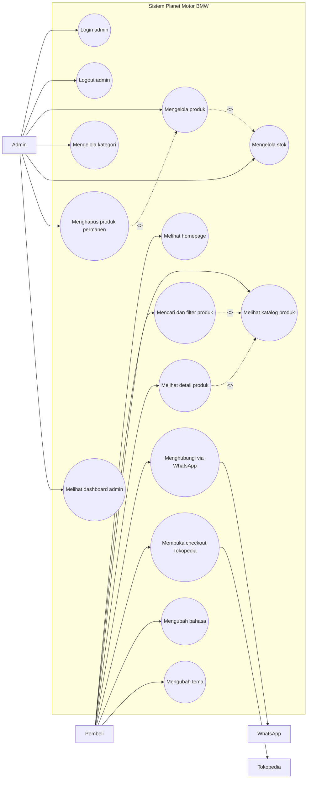

# Use Case Diagram Planet Motor BMW

Diagram berikut menggambarkan aktor utama dan fungsi sistem Planet Motor BMW sebagai platform katalog spare part BMW dan admin inventory.

## Ringkasan Aktor

| Aktor | Peran |
|---|---|
| Pembeli | Melihat katalog spare part BMW, mencari produk, melihat detail, lalu diarahkan ke WhatsApp atau Tokopedia. |
| Admin | Mengelola katalog, kategori, stok, dan dashboard admin. |
| Tokopedia | Kanal eksternal untuk transaksi/checkout produk. |
| WhatsApp | Kanal eksternal untuk konsultasi, tanya stok, dan komunikasi langsung. |

## Catatan Scope

- Sistem tidak memiliki cart, checkout internal, payment gateway, atau upload bukti pembayaran.
- Pembelian diarahkan ke Tokopedia.
- Konsultasi dan bantuan pencarian part diarahkan ke WhatsApp.
